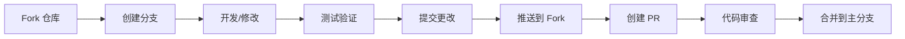

# 贡献指南

感谢您对 Claude Skills Hub 的关注！我们欢迎所有形式的贡献，包括技能开发、文档改进、错误修复等。

## 📋 目录

- [贡献方式](#贡献方式)
- [开发环境](#开发环境)
- [贡献流程](#贡献流程)
- [技能开发](#技能开发)
- [文档贡献](#文档贡献)
- [代码贡献](#代码贡献)
- [社区规范](#社区规范)
- [审核标准](#审核标准)

## 🤝 贡献方式

### 1. 开发 AI 技能
创建新的 AI 技能，扩展我们的技能库。

### 2. 改进现有技能
优化现有技能的功能、性能或用户体验。

### 3. 文档贡献
改进用户指南、开发者文档或技能说明。

### 4. 错误修复
修复平台或技能中的错误。

### 5. 功能建议
提出新功能建议和改进意见。

### 6. 测试反馈
测试新功能并提供反馈。

## 🛠️ 开发环境设置

### 基础要求

```bash
# 必需软件
- Node.js 18+
- npm 或 yarn 或 pnpm
- Git
- 代码编辑器 (推荐 VS Code)

# 推荐工具
- Claude Desktop (技能测试)
- GitHub Desktop (Git 管理)
- Chrome DevTools (调试)
```

### 环境配置

1. **Fork 仓库**
```bash
# 在 GitHub 上 Fork 主仓库到您的账户
```

2. **克隆仓库**
```bash
git clone https://github.com/YOUR_USERNAME/claude-skills-hub.git
cd claude-skills-hub
```

3. **安装依赖**
```bash
npm install
# 或
yarn install
```

4. **配置上游仓库**
```bash
git remote add upstream https://github.com/CavinHuang/claude-skills-hub.git
```

5. **启动开发服务器**
```bash
npm run dev
```

## 🔄 贡献流程

### 标准流程



### 详细步骤

1. **同步上游仓库**
```bash
git fetch upstream
git checkout main
git merge upstream/main
```

2. **创建功能分支**
```bash
git checkout -b feature/your-feature-name
# 或
git checkout -b fix/issue-number
```

3. **开发和测试**
```bash
# 进行开发工作
npm run test          # 运行测试
npm run lint          # 代码检查
npm run build        # 构建验证
```

4. **提交更改**
```bash
git add .
git commit -m "feat: add your feature description"
```

5. **推送到 Fork**
```bash
git push origin feature/your-feature-name
```

6. **创建 Pull Request**
- 在 GitHub 上创建 PR
- 填写详细的 PR 描述
- 等待代码审查

## 🎯 技能开发

### 技能类别

我们欢迎以下类别的技能贡献：

#### 🔧 开发类
- 代码生成和模板
- 测试自动化
- API 文档生成
- 代码重构工具
- 性能分析工具

#### 🎨 设计类
- UI 组件生成
- 设计系统创建
- 品牌指南生成
- 图片处理工具
- 色彩搭配工具

#### 💼 商业类
- 商业文档生成
- 数据分析报告
- 营销内容创建
- 项目管理工具
- 流程自动化

#### 📊 分析类
- 数据可视化
- 报告生成
- 趋势分析
- 用户行为分析
- 市场研究

#### 🎓 教育类
- 教学内容生成
- 课程设计工具
- 学习评估工具
- 知识问答系统

### 技能开发规范

#### 1. 文件结构
```
skill-name/
├── SKILL.md          # 技能主文档
├── LICENSE.txt       # 许可证
├── README.md         # 详细说明
├── examples/         # 使用示例
├── tests/            # 测试文件
├── assets/           # 资源文件
└── config/           # 配置文件
```

#### 2. SKILL.md 要求
```markdown
必须包含：
✅ 技能名称和描述
✅ 类别和标签
✅ 使用场景
✅ 前置要求
✅ 详细使用方法
✅ 配置选项
✅ 输出格式说明
✅ 限制和注意事项
✅ 版本历史
✅ 许可证信息
```

#### 3. 质量标准
- 功能完整性
- 文档清晰性
- 示例可运行性
- 错误处理完善
- 性能合理性

### 技能模板

使用我们的技能模板快速开始：

```bash
# 创建新技能
npm run create-skill <skill-name>
cd skills/<skill-name>
```

## 📚 文档贡献

### 文档类型

1. **用户文档**
   - 用户指南
   - 使用教程
   - 常见问题
   - 最佳实践

2. **开发者文档**
   - 开发指南
   - API 参考
   - 架构说明
   - 部署指南

3. **技能文档**
   - 技能说明
   - 使用示例
   - 集成指南
   - 故障排除

### 文档规范

#### Markdown 格式
```markdown
# 一级标题

## 二级标题

### 三级标题

- 列表项 1
- 列表项 2

`代码片段`

[链接文字](URL)


> 引用文本

```

#### 代码示例
```javascript
// 好的代码示例
const example = {
  clear: true,
  commented: true,
  tested: true
};
```

#### 文档检查清单
- [ ] 内容准确完整
- [ ] 格式规范统一
- [ ] 链接有效可用
- [ ] 图片清晰相关
- [ ] 代码示例可运行

## 💻 代码贡献

### 代码规范

#### JavaScript/TypeScript
```javascript
// ✅ 好的代码示例
const processSkillInput = (input, options = {}) => {
  // 输入验证
  if (!input || typeof input !== 'string') {
    throw new Error('Invalid input: input must be a non-empty string');
  }
  
  // 处理逻辑
  const processed = input.trim().toLowerCase();
  
  // 返回结果
  return {
    success: true,
    data: processed,
    timestamp: new Date().toISOString()
  };
};

// ❌ 避免的代码
const processInput = (i) => i.toLowerCase();
```

#### 组件开发
```typescript
// React 组件示例
interface SkillCardProps {
  skill: Skill;
  onDownload: (skill: Skill) => void;
  className?: string;
}

export const SkillCard: React.FC<SkillCardProps> = ({
  skill,
  onDownload,
  className = ''
}) => {
  return (
    <div className={`skill-card ${className}`}>
      <h3>{skill.name}</h3>
      <p>{skill.description}</p>
      <button onClick={() => onDownload(skill)}>
        下载技能
      </button>
    </div>
  );
};
```

### 测试要求

#### 单元测试
```javascript
describe('SkillProcessor', () => {
  it('should process valid input correctly', () => {
    const input = 'Test Input';
    const result = processSkillInput(input);
    expect(result.success).toBe(true);
    expect(result.data).toBe('test input');
  });
  
  it('should handle invalid input', () => {
    expect(() => processSkillInput('')).toThrow();
  });
});
```

#### 测试覆盖率
- 新功能：≥ 90%
- 修复：≥ 80%
- 重构：≥ 85%

## 👥 社区规范

### 行为准则

我们致力于为每个人提供友好、安全和欢迎的环境，无论：

- 性别、性别认同和表达
- 性取向
- 残疾
- 外貌
- 身体大小
- 种族
- 年龄
- 宗教

#### 预期行为

- 使用友好和包容的语言
- 尊重不同观点和经验
- 优雅地接受建设性批评
- 关注对社区最有利的事情
- 对其他社区成员表示同理心

#### 不当行为

- 使用性别化语言或图像
- 人身攻击或政治攻击
- 公开或私下骚扰
- 未经明确许可发布他人的私人信息
- 其他在专业环境中可能被认为不当的行为

### 沟通指南

#### GitHub Issues
- **Bug 报告**: 使用 bug 报告模板
- **功能请求**: 详细描述需求和用例
- **问题讨论**: 清晰描述问题和上下文

#### Pull Request
- **标题**: 清晰描述更改内容
- **描述**: 详细说明更改原因和实现
- **测试**: 确保所有测试通过
- **文档**: 更新相关文档

#### 代码审查
- **建设性**: 提供建设性的反馈
- **尊重**: 尊重他人的工作
- **学习**: 从代码中学习最佳实践
- **及时**: 及时响应审查请求

## 📋 审核标准

### 技能审核

#### 功能审核
- [ ] 技能功能完整且可用
- [ ] 示例清晰且可运行
- [ ] 错误处理完善
- [ ] 性能表现合理

#### 文档审核
- [ ] SKILL.md 信息完整
- [ ] README.md 说明详细
- [ ] 示例文档清晰
- [ ] 许可证正确

#### 质量审核
- [ ] 代码质量符合标准
- [ ] 测试覆盖充分
- [ ] 无安全漏洞
- [ ] 符合项目规范

### 代码审核

#### 技术标准
- [ ] 代码通过所有测试
- [ ] 符合编码规范
- [ ] 性能影响可接受
- [ ] 安全性符合要求

#### 文档标准
- [ ] 更新相关文档
- [ ] 添加必要的注释
- [ ] 示例代码可运行
- [ ] API 文档准确

## 🎉 贡献者认可

### 贡献者列表

所有贡献者都会被添加到项目的贡献者列表中：

- **GitHub 贡献者页面**: 自动显示所有贡献者
- **发布说明**: 在版本发布时感谢贡献者
- **社区展示**: 在社区活动中突出展示

### 贡献类型

我们认可以下类型的贡献：

- 💻 **代码贡献**: 新功能、修复、优化
- 📚 **文档贡献**: 改进文档、翻译、教程
- 🎨 **设计贡献**: UI/UX 改进、图标、主题
- 🐛 **测试贡献**: 测试用例、错误报告
- 💡 **创意贡献**: 功能建议、改进意见
- 🌍 **社区贡献**: 回答问题、社区支持

## 📞 获取帮助

如果您在贡献过程中遇到问题，可以通过以下方式获取帮助：

- **📧 贡献者邮件**: [contributors@claudeskill.site](mailto:contributors@claudeskill.site)
- **💬 GitHub Discussions**: [讨论区](https://github.com/CavinHuang/claude-skills-hub/discussions)
- **🐛 GitHub Issues**: [问题跟踪](https://github.com/CavinHuang/claude-skills-hub/issues)
- **📖 贡献文档**: [贡献指南](https://github.com/CavinHuang/claude-skills-hub/blob/main/CONTRIBUTING.md)

## 🙏 致谢

感谢所有为 Claude Skills Hub 做出贡献的开发者和用户！

您的贡献让这个项目变得更好，帮助更多人利用 AI 技能提升工作效率。

---

**🚀 期待您的贡献！**
